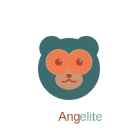

<div align="center">
  
  <h1>AngeLite</h1>
  <p><strong>A lightweight Angular-inspired framework that runs directly in the browser</strong></p>
  <p>
    <a href="#features">Features</a> •
    <a href="#getting-started">Getting Started</a> •
    <a href="#examples">Examples</a> •
    <a href="#documentation">Documentation</a> •
    <a href="#contributing">Contributing</a>
  </p>
</div>

<div align="center">
  <p>
    
    
  </p>
</div>

## Overview

AngeLite is a lightweight frontend framework inspired by Angular but designed to run directly in the browser without any build steps or compilation. It maintains the elegant syntax and powerful features of Angular while eliminating the need for complex tooling.

### Why AngeLite?

- **Zero Build Tools**: No need for webpack, babel, or any compilation step
- **Modern Syntax**: Uses the latest Angular-style syntax with @ decorators
- **Small Footprint**: Minimal bundle size for faster loading
- **Familiar API**: If you know Angular, you already know AngeLite
- **Enterprise Ready**: Designed for both small projects and large applications

## Features

- **Modern Component Architecture**: Create reusable UI components with encapsulated logic
- **Reactive Data Binding**: Automatic UI updates when your data changes
- **Modern Structural Directives**: Using @if, @for, @switch syntax (similar to Angular 20+)
- **Dependency Injection**: Powerful service system for sharing functionality
- **Routing**: Client-side navigation without page reloads
- **Forms**: Both template-driven and reactive forms with validation
- **Pipes**: Transform data directly in your templates
- **Component Communication**: Input/Output properties for parent-child communication
- **Lifecycle Hooks**: Control component behavior throughout its lifetime
- **Change Detection**: Efficient updates with fine-grained control

## Getting Started

### Installation

**Direct include:**

```html
<script src="https://unpkg.com/angelite/dist/angelite.min.js"></script>
```

**NPM:**

```bash
npm install angelite
```

**Import in your project:**

```javascript
import { Component, bootstrap } from 'angelite';
```

### Basic Usage

```javascript
// Define a component
import { Component, bootstrap } from './src/angelite.js';

@Component({
  selector: 'app-counter',
  template: `
    <div class="counter-container">
      <h2>{{ title }}</h2>
      <p>Count: {{ count }}</p>
      <button (click)="increment()">Increment</button>
      <button (click)="decrement()">Decrement</button>
      <button (click)="reset()">Reset</button>
    </div>
  `,
  styles: `
    .counter-container {
      padding: 20px;
      border: 1px solid #72a2ac;
      border-radius: 8px;
      max-width: 300px;
      margin: 0 auto;
    }
    button {
      margin-right: 8px;
      padding: 8px 16px;
      background-color: #3d6c6f;
      color: white;
      border: none;
      border-radius: 4px;
      cursor: pointer;
    }
    button:hover {
      background-color: #bf3f27;
    }
  `
})
class CounterComponent {
  title = 'AngeLite Counter';
  count = 0;
  
  increment() {
    this.count++;
  }
  
  decrement() {
    if (this.count > 0) {
      this.count--;
    }
  }
  
  reset() {
    this.count = 0;
  }
}

// Bootstrap the application
document.addEventListener('DOMContentLoaded', () => {
  bootstrap(CounterComponent, document.getElementById('app'));
});
```

## Examples

### Using Modern Structural Directives

```javascript
@Component({
  selector: 'app-user-list',
  template: `
    <div>
      <h2>User List</h2>
      
      @if (users.length > 0) {
        <ul>
          @for (user of users; track user.id) {
            <li>
              <strong>{{ user.name }}</strong>
              <p>{{ user.email }}</p>
              <button (click)="selectUser(user)">View Details</button>
            </li>
          }
        </ul>
      } @else {
        <p>No users found</p>
      }
      
      @if (selectedUser) {
        <div class="user-details">
          <h3>{{ selectedUser.name }}</h3>
          <p>Email: {{ selectedUser.email | lowercase }}</p>
          <p>Joined: {{ selectedUser.joinDate | date:'short' }}</p>
        </div>
      }
    </div>
  `
})
class UserListComponent {
  users = [
    { id: 1, name: 'Alice Smith', email: 'alice@example.com', joinDate: new Date(2023, 5, 15) },
    { id: 2, name: 'Bob Johnson', email: 'bob@example.com', joinDate: new Date(2023, 7, 22) },
    { id: 3, name: 'Carol Williams', email: 'carol@example.com', joinDate: new Date(2023, 9, 10) }
  ];
  
  selectedUser = null;
  
  selectUser(user) {
    this.selectedUser = user;
  }
}
```

### Using Reactive Forms

```javascript
import { Component, FormGroup, FormControl, Validators } from './src/angelite.js';

@Component({
  selector: 'app-registration',
  template: `
    <form [formGroup]="registrationForm" (submit)="onSubmit()">
      <div class="form-group">
        <label for="name">Name</label>
        <input type="text" id="name" formControlName="name">
        @if (formErrors.name) {
          <div class="error">{{ formErrors.name }}</div>
        }
      </div>
      
      <div class="form-group">
        <label for="email">Email</label>
        <input type="email" id="email" formControlName="email">
        @if (formErrors.email) {
          <div class="error">{{ formErrors.email }}</div>
        }
      </div>
      
      <div class="form-group">
        <label for="password">Password</label>
        <input type="password" id="password" formControlName="password">
        @if (formErrors.password) {
          <div class="error">{{ formErrors.password }}</div>
        }
      </div>
      
      <button type="submit" [disabled]="!registrationForm.valid">Register</button>
    </form>
    
    @if (submissionSuccess) {
      <div class="success-message">
        Registration successful!
      </div>
    }
  `
})
class RegistrationComponent {
  registrationForm = new FormGroup({
    name: new FormControl('', [Validators.required, Validators.minLength(3)]),
    email: new FormControl('', [Validators.required, Validators.email]),
    password: new FormControl('', [Validators.required, Validators.minLength(8)])
  });
  
  formErrors = {};
  submissionSuccess = false;
  
  constructor() {
    this.registrationForm.valueChanges.subscribe(() => {
      this.validateForm();
    });
  }
  
  validateForm() {
    this.formErrors = {};
    
    const controls = this.registrationForm.controls;
    
    if (controls.name.invalid && controls.name.touched) {
      if (controls.name.errors.required) {
        this.formErrors.name = 'Name is required';
      } else if (controls.name.errors.minlength) {
        this.formErrors.name = 'Name must be at least 3 characters';
      }
    }
    
    if (controls.email.invalid && controls.email.touched) {
      if (controls.email.errors.required) {
        this.formErrors.email = 'Email is required';
      } else if (controls.email.errors.email) {
        this.formErrors.email = 'Please enter a valid email';
      }
    }
    
    if (controls.password.invalid && controls.password.touched) {
      if (controls.password.errors.required) {
        this.formErrors.password = 'Password is required';
      } else if (controls.password.errors.minlength) {
        this.formErrors.password = 'Password must be at least 8 characters';
      }
    }
  }
  
  onSubmit() {
    if (this.registrationForm.valid) {
      console.log('Form submitted:', this.registrationForm.value);
      this.submissionSuccess = true;
      this.registrationForm.reset();
    } else {
      this.registrationForm.markAllAsTouched();
      this.validateForm();
    }
  }
}
```

## Documentation

For detailed documentation, check out the following resources:

- [API Reference](./docs/api-reference.md)
- [Component Guide](./docs/components.md)
- [Directives Guide](./docs/directives.md)
- [Routing Guide](./docs/routing.md)
- [Forms Guide](./docs/forms.md)
- [Dependency Injection](./docs/dependency-injection.md)

## Brand Colors

AngeLite uses the following color palette:

- **Primary Red**: `#bf3f27` - Used for primary actions and emphasis
- **Secondary Orange**: `#ef7b4f` - Used for secondary elements and highlights
- **Neutral Tan**: `#cb9573` - Used for backgrounds and neutral elements
- **Light Teal**: `#72a2ac` - Used for accents and supporting elements
- **Dark Teal**: `#3d6c6f` - Used for text and dark UI elements

## Contributing

We welcome contributions to AngeLite! Please see our [Contributing Guide](./CONTRIBUTING.md) for details.

## License

AngeLite is [MIT licensed](./LICENSE).

